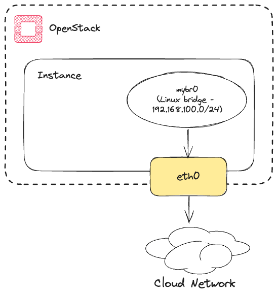

# DevStack(OpenStack) on AWS

- DevStack Doc: https://docs.openstack.org/devstack/latest/
- Platform: AWS
- OS: Ubuntu 22.04

- References
  - https://velog.io/@lijahong/0%EB%B6%80%ED%84%B0-%EC%8B%9C%EC%9E%91%ED%95%98%EB%8A%94-Terraform-%EA%B3%B5%EB%B6%80-Terraform-OpenStack
  - https://printf.kr/14

## How will we provide a `provider network`?

A `provider network` is, in OpenStack terms, a network that is Internet-capable (usually with a public IP). This network provides a floating IP to OpenStack or a NAT IP for a virtual network.
By default, a cloud instance is provided with one `NIC` port connected to an Internet-enabled network. Because the IP of the provider network is automatically assigned and managed by the cloud, it is difficult for OpenStack to use it arbitrarily. Therefore, we need to create a `virtual provider network` inside the instance and make it available to OpenStack.

### Creating a virtual provider network with Linux Bridge

To create a fictitious provider network, It will use Linux Bridge. After assigning a private network to Linux Bridge, it will use iptables to configure an internet-enabled interface and NAT so that the bridge network is also internet-enabled.



```bash
apt install bridge-utils

brctl addbr mybr0
ifconfig mybr0 192.168.100.1 netmask 255.255.255.0 up
ip link set mybr0 up

iptables -I FORWARD -j ACCEPT
iptables -t nat -I POSTROUTING -s 192.168.100.0/24 -j MASQUERADE
```

### Making horizon accessible from the outside

When we install devstack, it specifies the api endpoints, including horizon, with the ip set on the OS by default. The ip set in the cloud instance OS is private band, so even if we attach a floating ip (elastic ip in AWS) to the instance, it is difficult to make the api endpoints and horizon fully externally available. Therefore, we need to add the instance's `floating ip` to the devstack configuration file and add the ip to the loopback interface so that we can bind to it. For example, if the floating IP associated with our instance is `1.2.3.4`, add the IP to the loopback interface like this

```bash
ip addr add 1.2.3.4/32 dev lo
```

## Setting up local.conf

In this configuration, it's using `openvswitch` to build a network, using `192.168.100.0/24` as the `floating IP` band, and the interface serving that network is the `mybr0` Linux Bridge that created above.

This setup uses mybr0 as the public interface and creates an ovs bridge `br-ex` for ovs to connect to the floating ip network by creating an ovs bridge `br-ex` to use the public network. 

```ini
[[local|localrc]]
HOST_IP=1.2.3.4
FORCE=yes
ADMIN_PASSWORD=secret
DATABASE_PASSWORD=$ADMIN_PASSWORD
RABBIT_PASSWORD=$ADMIN_PASSWORD
SERVICE_PASSWORD=$ADMIN_PASSWORD

disable_service etcd3

## Neutron options
Q_USE_SECGROUP=True
FLOATING_RANGE="192.168.100.0/24"
IPV4_ADDRS_SAFE_TO_USE="10.0.0.0/22"
Q_FLOATING_ALLOCATION_POOL=start=192.168.100.50,end=192.168.100.250
PUBLIC_NETWORK_GATEWAY="192.168.100.1"
PUBLIC_INTERFACE=mybr0

# Open vSwitch provider networking configuration
Q_USE_PROVIDERNET_FOR_PUBLIC=True
OVS_PHYSICAL_BRIDGE=br-ex
PUBLIC_BRIDGE=br-ex
OVS_BRIDGE_MAPPINGS=public:br-ex
```

If we check the interface through `ip a`, we will see that `192.168.100.1`, which was assigned to `mybr0`, has been moved to `br-ex`.